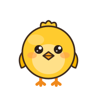

# piyo-assets

ぴよぴよランド共通のSVG素材ライブラリ（シールポップ画風）。

4つの姉妹サイト — **街（ぴよぴよランド）／おつかいめいろ／ぴよぴよさんすう／ぴよぴよことば** — が共有する、絵文字を置き換えるためのオリジナルSVGモチーフ集です。全 **78 モチーフ**。一覧と使用アプリ対応は [INDEX.md](./INDEX.md) を参照。

```
piyo-assets/
├── svg/            78個の <id>.svg（本体）
├── voice/          共有音声クリップ 14個（VOICEVOX:ずんだもん）＋ voice/INDEX.md
├── bgm/            オルゴール風BGMの共有エンジン（engine.ts / engine.js）と4曲（songs.ts / songs.js）・試聴 preview/ ＋ bgm/README.md
├── INDEX.md        id / ラベル / 使用アプリ / 用途の一覧表
├── README.md       このファイル
└── reference/      画風の見本（style-samples.html）・contact sheet・審査スクショ
    └── kenney-comparison/  Kenney素材の採否審査記録（結論: 全モチーフ自作・採用0）
```

## 画風 — 「シールポップ」

LINEスタンプ／ステッカー風。**太い白フチで型抜き（die-cut）し、濃いこげ茶で輪郭を締め、はっきりビビッドな配色**で小さくてもよく目立たせる。4〜5歳が一目で「なにか」を認識でき、かわいいと感じることを最優先する。

- **白フチ（die-cut underlay）**：各SVGの先頭に、全形状を `fill/stroke #ffffff` `stroke-width="15" stroke-linejoin/linecap="round"` でまとめた下地グループを置き、輪郭の外側に太い白縁を焼き込む。ステッカーらしい浮き出しを出す。
- **こげ茶アウトライン**：主要形状の輪郭は `stroke="#3d2a1c"`（約 `stroke-width` 3〜3.4）。瞳など最暗部のみ `#2a1e16`。
- **ビビッド配色**：くすませず、はっきりした原色寄り。ベタ塗り＋軽い内側シェーディング＋白ハイライトで立体感。
- **かわいさの記号**：キャラ・野菜・果物は**大きな瞳（白ハイライト2点）とピンクの頬**を基本にする。ぴよの表情は喜び／落ち着き／眠りの3種のみ（恐怖・怒りは出さない＝WORLD.md準拠）。
- **共通ジオメトリ**：全モチーフ `viewBox="0 0 200 200"`、主対象は中央・余白バランス一定。48pxまで縮めても判読できる太さで描く。

見本は [`reference/style-samples.html`](./reference/style-samples.html) の「シールポップ」節（ぴよ・ばなな・いぬ・いえ）が正典。

## 技術規約

- **単一ファイル・自己完結**：1モチーフ = 1つの `.svg`。外部参照・外部フォント・ラスタ埋め込みなし。
- **`viewBox="0 0 200 200"` 固定**。`width/height` は付けず、使う側で拡縮する（全モチーフ共通スケール）。
- **フィルタ不使用**：`filter` / `feGaussianBlur` / `drop-shadow` は使わない。影・白フチはパスで表現（レンダラ差異とパフォーマンスのため）。白フチは上記の die-cut underlay で焼き込む。
- **アクセシビリティ**：`role="img"` ＋ ひらがな/カタカナの `aria-label`（例 `aria-label="ぴよ"`）。
- **色の型抜きは clipPath でローカル完結**。`id` はファイル内で重複しても実害が出にくい命名だが、複数を同一DOMにインライン展開する場合はビルド側で名前空間化することを推奨。
- **命名**：`<id>.svg`。`id` はローマ字（ことばの語は `words.ts` の `id` と一致、例 `ninjin`, `kyuukyuusha`）。ぴよの表情は `piyo` / `piyo-yorokobi` / `piyo-nemui`。

### 使い方

インライン展開（推奨。CSS で色や演出を足せる）:

```html
<span class="piyo" style="width:96px" v-html="/* svg/piyo.svg の中身 */"></span>
```

または `` / CSS 背景として:

```html

```

いずれも `viewBox` があるため任意サイズに拡縮できる。48px 相当のUIアイコンから 200px 超のヒーロー表示まで同一ファイルで賄う。

## 対応アプリ

| 略 | アプリ | 役割 |
|---|---|---|
| 街 | [ぴよぴよランド](https://kerokero-1245.github.io/) | 街（ランチャー）。段階発展の飾り・ぴよ・施設・背景 |
| 迷 | [おつかいめいろ](https://kerokero-1245.github.io/otsukai-meiro/) | ゴールプール・アバター・障害物 |
| 数 | [ぴよぴよさんすう](https://kerokero-1245.github.io/piyopiyo-sansu/) | かず当ての題材キャラ |
| 言 | [ぴよぴよことば](https://kerokero-1245.github.io/piyopiyo-kotoba/) | 語彙40語の絵札 |

各アプリでの1件ごとの用途は [INDEX.md](./INDEX.md)。

## 音声（voice/）

3アプリ＋街で共通に使う日本語よみあげクリップの正典を [`voice/`](./voice/) にまとめている（14個・約215KB）。
すべて **VOICEVOX / ずんだもん（あまあま・style id 1）** で事前生成した同梱アセット（AAC 64kbps モノラル `.m4a`）。
統一idは `t_*`（タイトル）・`p_*`（ほめ／定型句）・`e_*`（誤答フォロー＝やわらか、否定語なし）。
id・セリフ・生成設定・クレジットの一覧は [`voice/INDEX.md`](./voice/INDEX.md)。クレジットは **VOICEVOX:ずんだもん**。

## ライセンス

**SVGはすべてオリジナル作品**（このプロジェクトのために手描きした一次創作）。既存の絵文字フォント・第三者素材のトレースや複製は含まない。ぴよぴよランド及びその姉妹アプリでの利用を想定。再配布・改変時はこの由来を保ってください。

**音声（voice/）** は VOICEVOX の音声合成で生成したもの。クレジット表記は **VOICEVOX:ずんだもん**（VOICEVOX 利用規約に基づく）。各アプリの「おとなモード」下部にも明記している。
